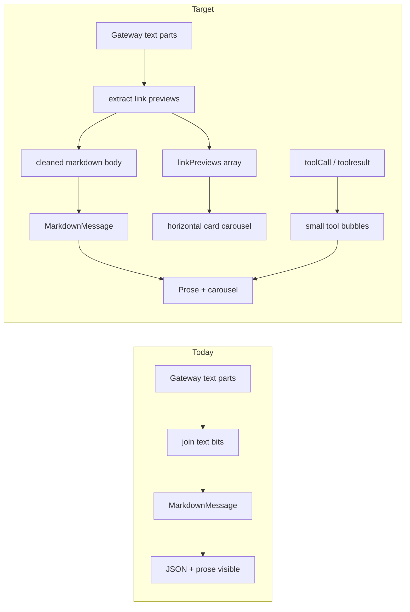

# Plan: Search carousel, tool micro-bubbles, and width-safe chat

## Diagnosis

- In [`src/api/gateway-types.ts`](src/api/gateway-types.ts), `parseContentParts` joins every `type: "text"` segment with `\n\n` into `body`. There is no handling for **JSON blobs that are really structured data** (e.g. `[{ "url", "title" }, …]`). That string is passed to [`MarkdownMessage`](src/components/MarkdownMessage.tsx) inside [`ChatBubble`](src/components/ChatBubble.tsx), so users see a huge JSON block above normal markdown prose.
- [`imageUrls`](src/api/gateway-types.ts) only comes from `image` / `image_url` parts, so **page URLs inside JSON never become a visual carousel**.
- [`mapRawHistoryMessage`](src/api/gateway-types.ts) for `toolresult` builds `### Tool result (name)` plus a fenced code block via `formatMaybeJsonBody` — same “wall of JSON” for tool outputs that are really link lists, and **the same large bubble styling** as assistant text.
- **Tool calls** today appear only as appended lines in `bodyWithToolSummary` inside the main assistant bubble, not as their own compact rows.
- Streaming in [`src/api/gateway.ts`](src/api/gateway.ts) (`handleChatEvent`) only calls `onContentCallback` with `extractStreamText(message)` for both `delta` and `final`. [`App.tsx`](src/App.tsx) **concatenates chunks** into `content` and never re-parses on `final`.
- **Width risk:** [`ChatBubble`](src/components/ChatBubble.tsx) uses `maxWidth: '85%'` on the paper, but **wide content** (pre/code, long URLs, horizontal strips) can still force the **flex parent** to grow unless the chat column uses `minWidth: 0`, `overflow: hidden` (or `auto`), and inner markdown/code uses `overflow-x: auto` / `word-break` where appropriate.

## Approach

### 1. Add a small, defensive extractor (new util or inside `gateway-types`)

- Implement something like `extractLinkPreviewsFromTextSegment(segment: string): { links: LinkPreview[]; consumed: boolean }` where `LinkPreview = { url: string; title?: string }`.
- **Trigger only when the segment is JSON-only** (after trim): `JSON.parse` succeeds and the value matches a **narrow schema**:
  - Top-level **array** of objects where each has a string `url` (allow `http://` / `https://` only) and optional `title` / `name` / `snippet` (use first non-empty as label).
  - Or top-level **object** with a single well-known array property (`results`, `links`, `items`, `organic`, etc.) of the same row shape — keep the allowlist small to avoid stripping arbitrary JSON.
- **Dedupe** by URL; cap list length (e.g. 20) for UI safety.
- **Compose**: run this on each `text` bit in `parseContentParts` before pushing to `textBits`. If `consumed`, do not append that bit to body; merge links into a new accumulator. After the loop, optionally run once on the full joined `body` for edge cases where JSON and markdown sit in one part (only strip if a leading/trailing JSON-only block is detected via bounded try-parse, to avoid eating user JSON examples).

### 2. Extend parsed types and history mapping

- Add `linkPreviews?: LinkPreview[]` to `ParsedContentParts` and populate it from the extractor.
- Add `linkPreviews?: LinkPreview[]` to [`FetchedChatMessage`](src/api/gateway-types.ts).
- In `mapRawHistoryMessage` for normal assistant/user paths, pass `linkPreviews` through from `parsed` (assistant-focused; user messages can omit or pass through if ever present).
- For **`toolresult`**: when parsed body JSON matches the same link-list schema, **do not** dump fenced JSON into `content`; set `linkPreviews` and use a **minimal label** for the tool-result bubble (see §4). For other tool bodies, keep a **short** summary string for the small result bubble (truncated), not a full fenced wall inside the main assistant bubble.

### 3. Web search results: horizontal card carousel

- Extend [`Message`](src/App.tsx) with `linkPreviews?: LinkPreview[]`.
- [`mapHistoryToMessages`](src/App.tsx): copy `msg.linkPreviews`.
- In [`ChatBubble`](src/components/ChatBubble.tsx) (or a dedicated `SearchResultsCarousel.tsx`):
  - Render `linkPreviews` as a **row of fixed-width cards** inside an `overflow-x: auto` container (same scroll pattern as the image strip, but **card UI**: subtle border/elevation, title 2-line clamp, hostname caption, external link).
  - Optional polish: `scroll-snap-type: x mandatory` + `scroll-snap-align: start` on cards for a clearer carousel feel; `gap` consistent with theme.
  - Cards must have `flex: '0 0 auto'` and an explicit `maxWidth` (e.g. `min(280px, 75vw)` relative to viewport, but **clamped by the chat column** — see §5) so the row scrolls instead of growing the layout.

### 4. Small tool call and tool result bubbles

- **Goal:** Visually distinct from user/assistant bubbles: **narrower max width** (e.g. `maxWidth: 'min(92%, 420px)'` or centered column), **smaller typography** (`caption` / `body2`), **muted background** (e.g. `grey.100` / outlined variant), **no** large markdown body for raw JSON.
- **Tool call:** When parsing yields `toolLines` (or streaming exposes tool calls), represent each as a **Message variant** (e.g. `role: 'ai'` + `bubbleKind: 'toolCall'` or a dedicated `role: 'toolCall'` if you prefer strict typing) with content like `name` + **collapsed** args (one line, heavily truncated) — render with a new **`ToolCallBubble`** component.
- **Tool result:** Map `toolresult` history rows to **`ToolResultBubble`** instead of the main [`ChatBubble`](src/components/ChatBubble.tsx) markdown path. For link-list results, show **label + carousel** inside the small bubble; for other tools, show **truncated** text or “Tap to expand” only if needed later.
- **Streaming:** On deltas that only add tool metadata, either append micro-bubble rows in [`App.tsx`](src/App.tsx) or fold into `onAssistantFinal` ordering (implementation detail: keep chronological order of tool call → result → assistant text).

### 5. Contain width: nothing extends past the chat area

- **Chat column** (the `Box` / `Paper` wrapping the message list in [`App.tsx`](src/App.tsx)): ensure `width: '100%'`, **`maxWidth: '100%'`**, **`minWidth: 0`**, and **`overflowX: 'hidden'`** (or `auto` only on the scroll container you intend). This prevents flex children from blowing out the layout.
- **Per bubble wrapper** (the outer `Box` in [`ChatBubble`](src/components/ChatBubble.tsx)): add **`maxWidth: '100%'`** and **`minWidth: 0`** so `85%` is **85% of the column**, not of an unbounded parent.
- **Inner content:** [`MarkdownMessage`](src/components/MarkdownMessage.tsx) / prose: ensure **`pre` / `code` blocks** use **`overflowX: 'auto'`** and **`maxWidth: '100%'`** so long lines scroll inside the bubble instead of widening it.
- **Carousel row:** parent already `maxWidth: '100%'`; inner scroll `Box` **`overflowX: 'auto'`**, **`width: '100%'`**.

### 6. Fix live streaming vs history mismatch

- In [`gateway.ts`](src/api/gateway.ts), on `state === 'final'` (when `message` is present), compute a **normalized display payload** using the same pipeline as history:
  - Reuse `parseContentParts` + `bodyWithToolSummary` + a shared helper that returns `{ content: string; linkPreviews?: LinkPreview[]; imageUrls?: string[]; toolCalls?: … }` for assistant-like payloads (mirror `assistantDisplayBody` / error handling where applicable).
- Add a new callback to `initGatewayConnection`, e.g. `onAssistantFinal?: (payload) => void`, invoked only on `final` for the chat handler.
- In [`App.tsx`](src/App.tsx), when that fires, **replace** the last assistant row’s structured fields with the parsed payload (**merge on final** to strip JSON reliably).

### 7. Tests and edge cases

- Add unit tests for the extractor: array of `{url,title}`, wrapped object, invalid JSON, mixed prose + JSON in one string (should not strip prose), non-http URLs ignored.
- Optionally truncate `toolLines` JSON further for micro-bubbles so args never exceed one line.

## Files to touch (expected)

| Area | File |
|------|------|
| Parse + types | [`src/api/gateway-types.ts`](src/api/gateway-types.ts) |
| Final reconcile | [`src/api/gateway.ts`](src/api/gateway.ts) |
| State + history | [`App.tsx`](src/App.tsx) |
| Main bubble + carousel | [`src/components/ChatBubble.tsx`](src/components/ChatBubble.tsx), optional [`src/components/SearchResultsCarousel.tsx`](src/components/SearchResultsCarousel.tsx) |
| Tool UI | new [`src/components/ToolCallBubble.tsx`](src/components/ToolCallBubble.tsx), [`src/components/ToolResultBubble.tsx`](src/components/ToolResultBubble.tsx) |
| Markdown overflow | [`src/components/MarkdownMessage.tsx`](src/components/MarkdownMessage.tsx) |
| Tests | new `src/utils/extractLinkPreviews.test.ts` or co-located test next to util |

## Success criteria

- History reload: assistant messages show **markdown prose without** the raw search-results JSON; **web search links appear** in a **horizontally scrolling card carousel**.
- **Tool calls** and **tool results** appear as **small, distinct bubbles** (not full-width assistant prose blocks).
- **No message row** (including carousel, code blocks, and images) causes horizontal overflow beyond the chat column; wide content scrolls **inside** the bubble.
- After a streamed reply completes (`final`), the same cleaned body + carousel + tool rows appear without requiring refresh.
