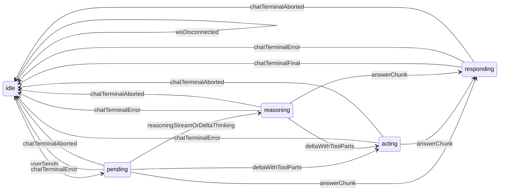
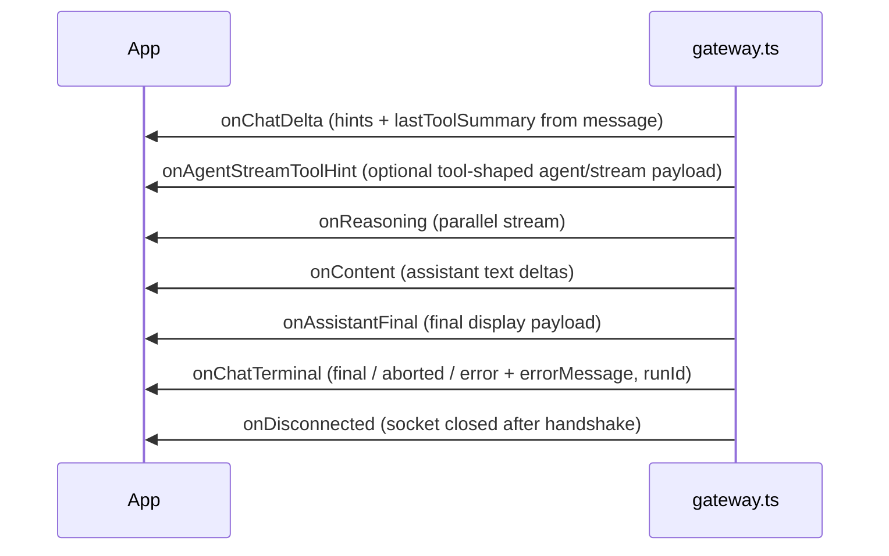

# Agent run phase (UI)

## Why it exists

The chat UI used to treat “assistant working” as a single **thinking** flag. That hid whether the gateway was reasoning, running tools, or streaming the final answer, and it could stay **stuck** after `error` / `aborted` terminal states or a dropped WebSocket. Explicit **run activity** and **terminal notices** make the chrome honest and recoverable.

## Conceptual model

Activity is **UI-only** state for the in-flight run. It is distinct from persisted messages in `chat.history`.

**Stale** is not in the diagram above: if activity is non-idle and there is no reasoning, delta, or content activity for ~90 seconds, the UI moves to `stale` so the user can send again or reconnect.

## Flows

## Technical details

| Piece | Role |
| --- | --- |
| `inferStreamPhaseHints` (`src/api/gateway-types.ts`) | Parses each `chat` **delta** payload like `extractStreamText`, plus tool/thinking parts, for phase hints. |
| `lastToolSummaryFromStreamMessage` (`src/utils/toolBubbleSummary.ts`) | Collapsed label for the **last** `toolCall` part in a delta; also tries a JSON **array** in `message.text` when it looks like structured content parts. |
| `toolHintFromAgentStreamData` (`src/utils/toolBubbleSummary.ts`) | Best-effort label from `agent…` / `stream` event `payload.data` (`toolCall` / `tool` / top-level `name` + `arguments`). |
| `onChatDelta` (`initGatewayConnection`) | Fires once per `state: 'delta'` before optional `onContent`; includes `lastToolSummary` (always applied in the UI when present, including after the first answer chunk). |
| `onAgentStreamToolHint` (`initGatewayConnection`) | Optional; fires when a non-chat agent/stream frame carries a tool-shaped payload (gateway version–dependent). |
| `onChatTerminal` | Passes `{ state, errorMessage?, runId? }` after handling the terminal `chat` event. |
| `requestGatewayReconnect` | Closes the socket and calls internal `connect()` again; callbacks from the last `initGatewayConnection` remain. |
| `src/utils/agentRunActivity.ts` | Pure helpers to map hints + chunks to `AgentRunActivity`, and `phaseBubbleDisplayText` for the phase bubble body. |
| `App.tsx` | Header chips, **phase bubble** (spinner + optional reasoning line or last-tool label), hides phase bubble while `responding`, skips empty in-thread assistant placeholder. There are **no** separate tool call/result bubbles in the main thread; tools and streamed thinking are shown in the **chain-of-thought modal** (opened from the phase bubble, **`reasoningTrace`** row, or header). **`onAssistantFinal`** runs `applyAssistantFinalWithThoughtBuffer` (`src/utils/recentThoughtsReducer.ts`): optional **`reasoningTrace`** row above the assistant, then merge into one assistant bubble. |
| `recentThoughtsReducer.ts` | Buffers `ThoughtItem`s for live callbacks; **`foldFetchedHistoryToMessages`** rebuilds from `chat.history`: one trace per **user-visible** assistant row (`assistantHistoryRowDisplaysToUser`), with gateway thinking (normalized as `reasoning`) folded as **`reasoningChunk`**s in the buffer; orphan buffer flushed at end of history if needed. |

## Technical gotchas

- **Live tool labels** come from `lastToolSummary` on each `chat` **delta** when the message shape includes `toolCall` parts (or a JSON array in `message.text` that parses as such). They also update from **`onAgentStreamToolHint`** when the gateway emits tool metadata on `agent…` / `stream` frames instead. If neither path fires, the phase bubble may show **spinner only** until answer or terminal.
- **History parity:** a single **`reasoningTrace`** precedes each assistant message that **displays to the user** (body, previews, images, or error)—not a separate trace for intermediate tool/thinking-only assistant rows. Assistant **content** omits embedded tool bullet lines (gateway `omitToolSummary`). **`toolresult`** rows only populate the buffer (one-line summaries).
- **“Using tools” phase** still depends on `inferStreamPhaseHints`; parallel `agent…` reasoning events drive **thinking** when they arrive first.
- **Stale timeout** is fixed in code (`AGENT_RUN_STALE_AFTER_MS` in `App.tsx`, default 90s), not an env var.
- **Intentional** `disconnectGateway()` closes with code `1000` / reason `client` so the UI does not treat React cleanup as an unexpected drop.
- **`onDisconnected`** only runs when the socket closes **after** a successful connect handshake and the close was not a deliberate client disconnect.

## Related documentation

- [Chain of thought](chain-of-thought.md) — `recentThoughts` buffer, `reasoningTrace` bubble on `onAssistantFinal`, and history fold.
- [New chat session](new-chat-session.md) — rotating `sessionKey`; New chat is disabled while a run is active.
