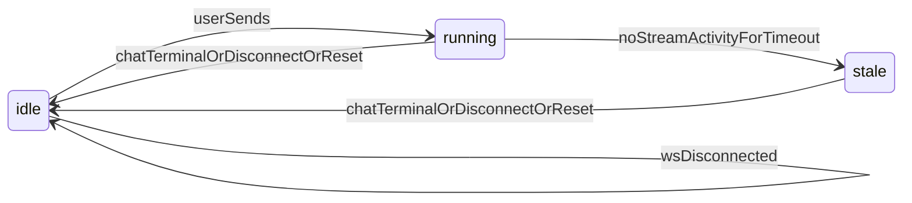
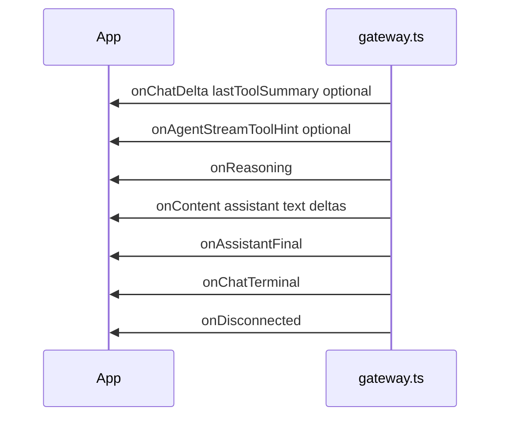

# Assistant run chrome (shell)

## Why it exists

The app shell needs a small amount of **non-message** state so the user knows when sending is blocked, when a run may have gone quiet, and what the input placeholder should say. That state is **not** a multi-step “phase” model and **does not** drive assistant bubble copy—the last assistant row derives spinner and optional tool-line text **inside** [`AgentChatBubble`](../src/components/AgentChatBubble.tsx) from `messageText`, `thoughtItems`, and shared reducers (e.g. `deriveLastToolSummaryLine`).

## Conceptual model

Shell state is **`idle` | `running` | `stale`** (`AssistantRunChromeState` in [`src/utils/assistantRunChrome.ts`](../src/utils/assistantRunChrome.ts)):

- **`running`:** Set when the user sends a message; cleared on `onChatTerminal`, `onDisconnected`, or local reset (new thread / clear).
- **`stale`:** If the shell is **`running`** and there is no stream activity for `AGENT_RUN_STALE_AFTER_MS` (default 90s in `App.tsx`), the UI moves to **`stale`** so the user can send again or reconnect. **`stale`** does **not** block sending (same as before).
- **`idle`:** No in-flight run from the shell’s perspective.

Gateway callbacks (`onReasoning`, `onChatDelta`, `onContent`) **do not** advance this enum; they only update messages, the live `recentThoughts` buffer, and the stream-activity timestamp used by the stale watchdog.

## Flows

## Technical details

| Piece | Role |
| --- | --- |
| [`assistantRunChrome.ts`](../src/utils/assistantRunChrome.ts) | `AssistantRunChromeState`, `isAssistantRunBlockingInput`, `inputPlaceholderForAssistantRun`. |
| [`gateway.ts`](../src/api/gateway.ts) | `onChatDelta` passes `lastToolSummary` only (no stream “hints” object for shell state). |
| [`App.tsx`](../src/App.tsx) | Holds `assistantRunChrome`; sets **`running`** on send, **`idle`** on terminal/disconnect/reset, **`stale`** from interval watchdog; disables input and “new conversation” while **`running`**. |
| [`AgentChatBubble.tsx`](../src/components/AgentChatBubble.tsx) | **Unchanged by shell refactors:** local `isThinking` / spinner and thought-process entry from props + utils—not from `AssistantRunChromeState`. |
| [`recentThoughtsReducer.ts`](../src/utils/recentThoughtsReducer.ts) | Buffers `ThoughtItem`s; `applyAssistantFinalWithThoughtBuffer` / `foldFetchedHistoryToMessages` for trace + assistant rows. |

## Technical gotchas

- **Stale timeout** is fixed in code (`AGENT_RUN_STALE_AFTER_MS` in `App.tsx`), not an env var.
- **Intentional** `disconnectGateway()` closes with code `1000` / reason `client` so the UI does not treat React cleanup as an unexpected drop.
- **`onDisconnected`** only runs when the socket closes **after** a successful connect handshake and the close was not a deliberate client disconnect.

## Related documentation

- [Chain of thought](chain-of-thought.md) — `recentThoughts` buffer, `reasoningTrace`, modal.
- [Multiple chat threads](multiple-chat-threads.md) — thread list, history fetch, routing.
- [New chat session](new-chat-session.md) — new conversation control; disabled while **`running`**.
