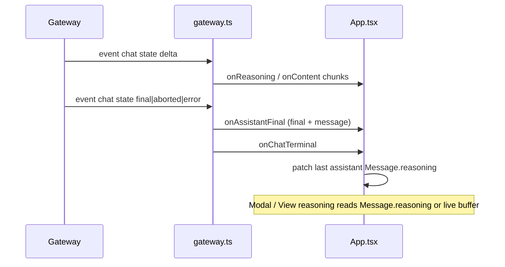

# Chain of thought in the UI

## Why it exists

The gateway can stream model **reasoning** separately from the main answer. Operators need a focused, dismissible surface to read that text without giving up main-column space on desktop, and they need to **reopen** reasoning after a turn finishes (when live streaming state is cleared).

## Conceptual model

- **Live reasoning** accumulates in memory while a run is in progress (`activeReasoning` in `App.tsx`).
- On each chat run **terminal** event (`final`, `aborted`, or `error` from the gateway `chat` event), the UI **snapshots** the current reasoning string onto the **last assistant message** in the thread so it survives the next send.
- A **floating dialog** (MUI `Dialog`) shows reasoning; it is not a permanent side panel.

## Flow

## Technical details

- **Modal:** `src/components/ChainOfThoughtModal.tsx` — header, close icon, scrollable monospace body, `sanitizeDisplayText` for display.
- **Persistence:** `src/api/gateway.ts` invokes `onChatTerminal` after handling `final` / `aborted` / `error`. `App.tsx` implements it with `patchLastAssistantWithReasoning`, using a ref (`activeReasoningRef`) so the snapshot matches the latest streamed reasoning even inside batched updates.
- **Triggers:** Thinking state uses a clickable `ChatBubble` on **all** breakpoints; completed assistant messages with stored reasoning show **View reasoning**; the header shows a brain icon when live or historical reasoning is available.

## Technical gotchas

- **React batching:** `onAssistantFinal` and `onChatTerminal` may run in the same tick; functional `setMessages` updates are applied in order so merge-then-patch stays consistent.
- **Modal + mobile:** Dialog content uses bottom padding with `env(safe-area-inset-bottom)` to reduce overlap with home indicators; focus is managed by MUI `Dialog`.
- **PWA / viewport:** If the modal feels clipped on a specific device, verify safe-area and browser chrome; hard refresh if a service worker serves an old bundle.
