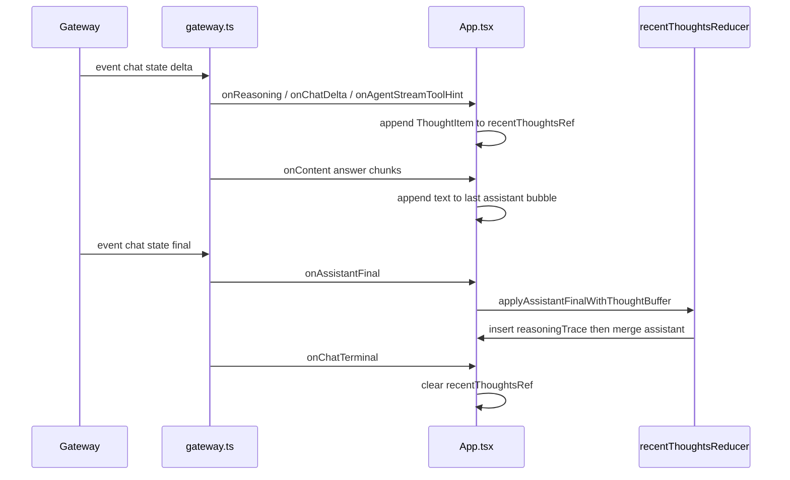

# Chain of thought in the UI

## Why it exists

The gateway can stream model **reasoning** separately from the main answer, and chat **deltas** can carry **tool** metadata. Operators need a compact thread view: answer text in the main assistant bubble, with tools and thinking summarized in a dedicated inline bubble, plus a dismissible **modal** for reading long text.

## Conceptual model

- **`recentThoughts` buffer (live):** While a run is in progress, `App.tsx` appends **non-answer** signals to a ref-backed list (`ThoughtItem[]`): reasoning stream chunks (`onReasoning`), tool labels from `onChatDelta` / `onAgentStreamToolHint`, and (on history replay) tool results. **Answer body text** still streams only via `onContent` into the last assistant bubble.
- **Flush on final:** When `onAssistantFinal` fires, if the buffer is non-empty **or** the final payload carries **prose reasoning** (`parseAssistantDisplayPayload` thinking), the UI inserts a **`reasoningTrace`** message **immediately above** the streaming assistant slot, then merges the final display payload into that assistant bubble. The buffer is cleared (and again on `aborted` / `error` / disconnect / new send).
- **Live overflow:** `activeReasoning` still mirrors streamed reasoning for the header brain icon and the in-run phase bubble; completed turns expose the same content via the trace bubble and **View full reasoning** (modal).
- **Gateway `thinking` vs UI `reasoning`:** Raw history uses content parts with `type: "thinking"`. [`parseContentParts`](src/api/gateway-types.ts) aggregates those into a string field named **`reasoning`** on [`FetchedChatMessage`](src/api/gateway-types.ts) and on live `parseAssistantDisplayPayload` output. That rename is UI-side normalization, not a second gateway event type.
- **History fold:** [`foldFetchedHistoryToMessages`](src/utils/recentThoughtsReducer.ts) walks `chat.history` in order. For each assistant row it appends tool hints, tool results (from prior `toolresult` rows), and **`reasoning`** text as **`reasoningChunk`** items into one buffer. It emits a **`reasoningTrace`** **only immediately before** an assistant row that **displays to the user**—non-empty body text, link previews, images, or an error ([`assistantHistoryRowDisplaysToUser`](src/utils/recentThoughtsReducer.ts)). Thinking-only or tool-only assistant rows do **not** flush by themselves (avoids double trace bubbles). If the transcript ends with a non-empty buffer and no such row, a final orphan **`reasoningTrace`** is emitted. **`toolresult`** rows only extend the buffer (no separate tool bubbles).

## Flow

## Technical details

- **Types:** `src/chatThreadTypes.ts` — `Message`, `ThoughtItem`, `kind: 'reasoningTrace'`.
- **Reducer:** `src/utils/recentThoughtsReducer.ts` — `appendThoughtItem` (dedupes consecutive identical tool hints), `assistantHistoryRowDisplaysToUser`, `applyAssistantFinalWithThoughtBuffer`, `foldFetchedHistoryToMessages`, `formatThoughtItemsForModal`.
- **Inline UI:** `src/components/ReasoningTraceBubble.tsx` — bullet list of tools / results, streamed thinking and `proseReasoning`, **View full reasoning** → `ChainOfThoughtModal`.
- **Modal:** `src/components/ChainOfThoughtModal.tsx` — `sanitizeDisplayText` for display.
- **Triggers:** Header brain icon when `activeReasoning` or the last completed trace / legacy `Message.reasoning` has text; in-run phase bubble still uses `phaseBubbleDisplayText` (see [Agent run phase](agent-run-phase.md)).

## Technical gotchas

- **`onAssistantFinal` and `onChatTerminal`** may run in the same tick; the buffer is cleared inside the `setMessages` callback for final, then again on terminal — idempotent.
- **Prose-only final:** If the buffer is empty but `payload.reasoning` is non-empty, a trace bubble is still inserted (tools list may be empty).
- **Modal + mobile:** Dialog content uses bottom padding with `env(safe-area-inset-bottom)`; hard refresh if a service worker serves a stale bundle.
