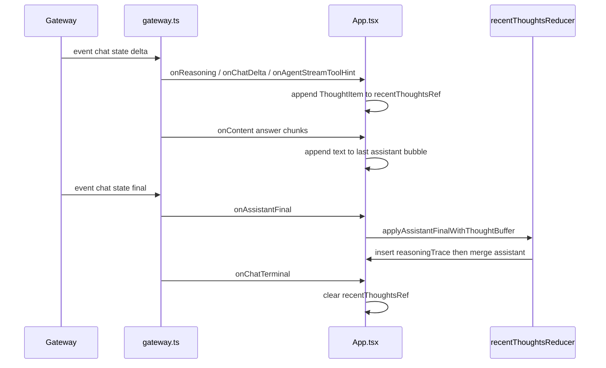
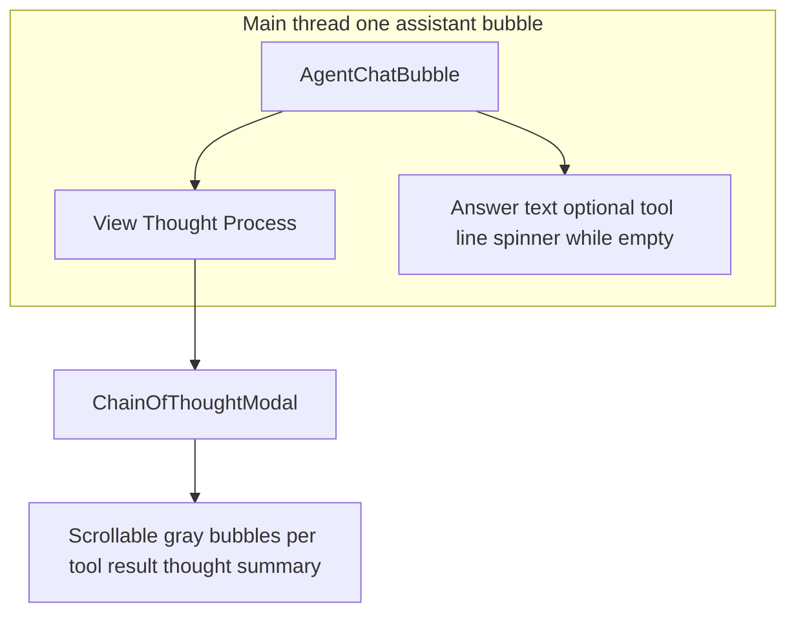

# Chain of thought in the UI

## Why it exists

The gateway can stream model **reasoning** separately from the main answer, and chat **deltas** can carry **tool** metadata. Operators need a compact thread view: answer text in the main assistant bubble, with a single inline affordance to open the full trace, plus a dismissible **modal** that reads like a small secondary thread.

## Conceptual model

- **`recentThoughts` buffer (live):** While a run is in progress, `App.tsx` appends **non-answer** signals to a ref-backed list (`ThoughtItem[]`): reasoning stream chunks (`onReasoning`), tool labels from `onChatDelta` / `onAgentStreamToolHint`, and (on history replay) tool results. **Answer body text** still streams only via `onContent` into the last assistant bubble.
- **Flush on final:** When `onAssistantFinal` fires, if the buffer is non-empty **or** the final payload carries **prose reasoning** (`parseAssistantDisplayPayload` thinking), the UI still inserts a **`reasoningTrace`** message **immediately before** the streaming assistant slot in state, then merges the final display payload into that assistant bubble. The buffer is cleared (and again on `aborted` / `error` / disconnect / new send). **Rendering** pairs that trace with the following assistant row: [`AgentChatBubble`](src/components/AgentChatBubble.tsx) shows the answer and a small top-left **View Thought Process** control wired to the trace payload (no separate grey trace row).
- **Live overflow:** Streamed reasoning and tool hints are appended as [`ThoughtItem`](src/chatThreadTypes.ts) rows in `recentThoughtsRef` (see `appendLiveThoughtItem` in `App.tsx`). While the in-flight assistant slot has no answer text yet, [`AgentChatBubble`](src/components/AgentChatBubble.tsx) uses component-local logic (`isThinking`, optional tool-line text via [`deriveLastToolSummaryLine`](src/utils/recentThoughtsReducer.ts) and streamed `messageText`)—**not** shell run state from `App.tsx`. **View Thought Process** appears when [`traceHasDisplayableContent`](src/utils/recentThoughtsReducer.ts) is true for the buffer (including prose from joined reasoning chunks). Opening the live modal uses structured `thoughtItems` when the buffer is non-empty, otherwise plain text is empty until items arrive.
- **Gateway `thinking` vs UI `reasoning`:** Raw history uses content parts with `type: "thinking"`. [`parseContentParts`](src/api/gateway-types.ts) aggregates those into a string field named **`reasoning`** on [`FetchedChatMessage`](src/api/gateway-types.ts) and on live `parseAssistantDisplayPayload` output. That rename is UI-side normalization, not a second gateway event type.
- **History fold:** [`foldFetchedHistoryToMessages`](src/utils/recentThoughtsReducer.ts) walks `chat.history` in order. For each assistant row it appends tool hints, tool results (from prior `toolresult` rows), and **`reasoning`** text as **`reasoningChunk`** items into one buffer. It emits a **`reasoningTrace`** **only immediately before** an assistant row that **displays to the user**—non-empty body text or an error ([`assistantHistoryRowDisplaysToUser`](src/utils/recentThoughtsReducer.ts)). Thinking-only or tool-only assistant rows do **not** flush by themselves (avoids double trace bubbles). If the transcript ends with a non-empty buffer and no such row, a final orphan **`reasoningTrace`** is emitted (rendered as an assistant-style bubble with only **View Thought Process**). **`toolresult`** rows only extend the buffer (no separate tool bubbles in the main thread).

## Flow

## Technical details

- **Types:** `src/chatThreadTypes.ts` — `Message`, `ThoughtItem`, `kind: 'reasoningTrace'`.
- **Reducer:** `src/utils/recentThoughtsReducer.ts` — `appendThoughtItem` (dedupes consecutive identical tool hints), `traceHasDisplayableContent`, `assistantHistoryRowDisplaysToUser`, `applyAssistantFinalWithThoughtBuffer`, `foldFetchedHistoryToMessages`, `formatThoughtItemsForModal` (string export / tests), `thoughtItemsToModalSegments` (merges adjacent `reasoningChunk` for modal rows), `findLastHistoricalChainOfThought` (tests / helpers for historical trace detection).
- **Inline UI:** `src/components/AgentChatBubble.tsx` — assistant chrome with optional **View Thought Process** link; local `isThinking` and body text from `messageText` / `thoughtItems`. User rows use `src/components/UserChatBubble.tsx` with **`messageText` only** (no link previews or inline images).
- **Modal:** `src/components/ChainOfThoughtModal.tsx` — `content` is either `{ mode: 'structured', thoughtItems, proseReasoning? }` or `{ mode: 'plain', text }` (legacy assistant `reasoning`). Renders `ThoughtProcessModalSegment` rows as small gray bubbles; `sanitizeDisplayText` on each segment body.
- **Triggers:** **View Thought Process** on the assistant bubble (paired `reasoningTrace` data, live buffer, or legacy `Message.reasoning`).

## Technical gotchas

- **`onAssistantFinal` and `onChatTerminal`** may run in the same tick; the live buffer is cleared when handling final (outside a `setMessages` updater) and again on terminal — idempotent.
- **React Strict Mode / pure updaters:** Never read or clear `recentThoughtsRef` inside a `setMessages` functional updater. Strict Mode (dev) may run that updater twice with the same `prev`; the first pass would empty the ref so the second pass applies `onAssistantFinal` with an empty buffer and **drops** the `reasoningTrace` row. Snapshot the buffer into a local array, clear the ref, then call `setMessages((prev) => applyAssistantFinalWithThoughtBuffer(prev, payload, snapshot, traceId))`.
- **Ref vs render:** The UI reads `recentThoughtsRef` during render to decide whether to show the live thought-process control. Ref mutations alone do not re-render. `App.tsx` bumps `thoughtBufferRevision` whenever `appendThoughtItem` returns a new array so the affordance appears as soon as the buffer grows.
- **Prose-only final:** If the buffer is empty but `payload.reasoning` is non-empty, a trace message is still inserted (the control still opens modal content that includes that prose segment).
- **Modal + mobile:** Dialog content uses bottom padding with `env(safe-area-inset-bottom)`; hard refresh if a service worker serves a stale bundle.
- **Tools-only live buffer:** If tools stream before any reasoning text, the buffer can contain only `toolHint` / `toolResult` rows; **View Thought Process** still opens structured content when [`traceHasDisplayableContent`](src/utils/recentThoughtsReducer.ts) passes.
