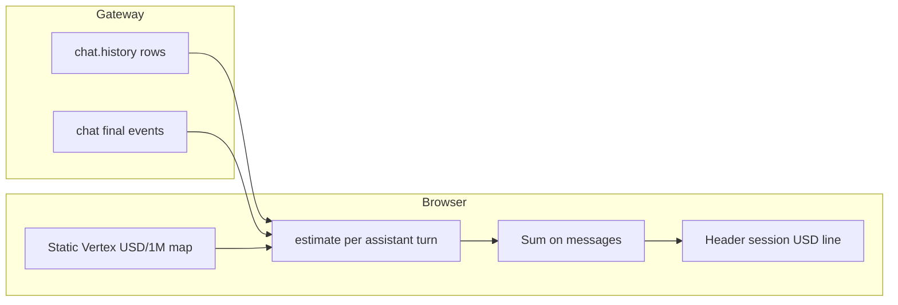

# Gemini pricing estimates (client-side)

## Why it exists

The gateway may expose **`usage.cost`** for billing-adjacent totals, but operators also want a **rough per-session dollar sense** tied to **token counts** and **public list prices** for Google Gemini models. This UI adds a **client-side estimate** from per-turn `usage` fields multiplied by a **curated static table** (`src/data/googleGeminiModelPricing.ts`), plus a **Model pricing** dialog to browse that table.

## Conceptual model

- **Estimate ≠ invoice** — Numbers are **from published Vertex AI Generative AI pricing** (Standard tier, USD) at the **as-of date** in code. Your bill depends on region, tier, promotions, long-context pricing, and Google’s current pages.
- **Google-only** — Estimates apply only when the row is treated as a **Google** assistant turn (`provider`, `api`, or model id heuristics). Other providers are not priced by this table.
- **Input/output required** — If the gateway only sends **`totalTokens`** without **input** and **output** breakdowns, the UI **does not guess** a split; that turn contributes **no** estimate.

## Flows

1. **History** — `mapRawHistoryMessage` attaches optional **`estimatedCostUsd`** when usage is estimable. **`foldFetchedHistoryToMessages`** accumulates estimates from assistant rows that do not produce a visible bubble and attaches them to the next visible assistant message (or the last one) to avoid under-counting tool-heavy turns.
2. **Live stream** — **`chat` final** payloads are parsed with the same pricing logic; **`sessionKey`** routing treats short keys (`webchat-…`) as matching canonical gateway keys (`agent:main:…`) so finals apply to the active thread.
3. **Header** — The stats line shows **`~$X.XX`** (two decimal places) for the **active chat only** when the sum of **`Message.estimatedCostUsd`** is defined. It does **not** show gateway **`usage.cost`** rollups. Conversation rows may still show gateway per-session USD when the payload includes it.
4. **Modal** — **Conversations** drawer footer → **Model pricing** opens a searchable table of the static map, disclaimer, and as-of date.

## Technical details

| Piece | Role |
| --- | --- |
| [`src/data/googleGeminiModelPricing.ts`](../src/data/googleGeminiModelPricing.ts) | USD per 1M tokens, `GEMINI_MODEL_PRICING_AS_OF`, source notes. |
| [`src/utils/geminiPricingEstimate.ts`](../src/utils/geminiPricingEstimate.ts) | Normalize model refs, parse usage, `estimateUsdFromUsage`, `sumMessageEstimatedUsd`. |
| [`src/components/GoogleGeminiPricingModal.tsx`](../src/components/GoogleGeminiPricingModal.tsx) | MUI dialog: filter + table. |
| [`src/App.tsx`](../src/App.tsx) | Footer button, header session total line. |

## Technical gotchas

- **Stale table** — List prices change; the map is updated only when this repo is updated. Check **`GEMINI_MODEL_PRICING_AS_OF`** in the data file.
- **Mixed providers** — Non-Google models are skipped for the header session total; the sum only includes priced turns.
- **Double counting** — Folding logic is designed so each gateway usage block is counted once toward visible assistant bubbles; edge cases (e.g. no assistant message to attach pending spend) are possible—see implementation comments in [`recentThoughtsReducer`](../src/utils/recentThoughtsReducer.ts).

For multi-thread behaviour and **`sessionKey`** routing, see [Multiple chat threads](./multiple-chat-threads.md).
