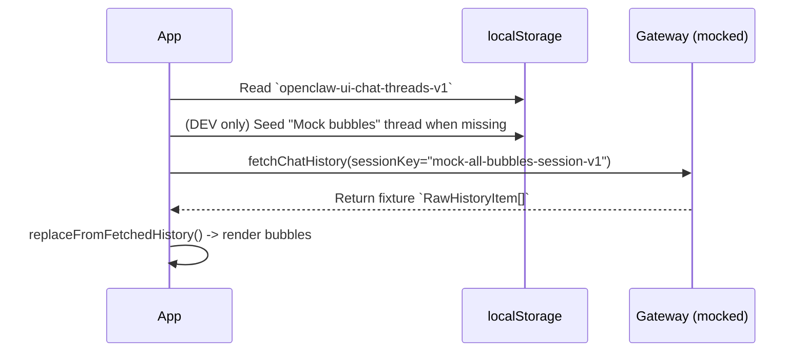

# Mock chat thread (bubble showcase)

## Why it exists

Developers need an easy way to preview all supported chat bubble types without relying on a live gateway transcript. This repo seeds a dev-only “Mock bubbles” conversation and hydrates it with a mocked `chat.history` payload.

## Conceptual flow

## Technical details

- **Fixture data**
  - [`src/mocks/mockChatHistory/mockAllBubblesRawHistoryItems.ts`](../src/mocks/mockChatHistory/mockAllBubblesRawHistoryItems.ts)
  - Contains a minimal transcript that yields:
    - a `UserChatBubble`
    - an `AgentChatBubble` (normal assistant message)
    - an `AssistantErrorChatBubble`
    - an `AssistantAbortedChatBubble`

- **Thread seeding (DEV only)**
  - [`src/utils/chatThreadsStorage.ts`](../src/utils/chatThreadsStorage.ts)
  - On first load (or when the saved snapshot is missing the mock session), in `import.meta.env.DEV` and when `VITE_OPENCLAW_SESSION_KEY` is **not** set:
    - adds a `Mock bubbles` thread with session key `mock-all-bubbles-session-v1`
    - makes it the active thread when the snapshot is freshly created

- **Mock `chat.history`**
  - [`src/api/gateway.ts`](../src/api/gateway.ts)
  - When `fetchChatHistory()` is called with `sessionKey === mock-all-bubbles-session-v1`, it returns the fixture transcript (mapped through the existing `mapRawHistoryMessage` logic).

- **Applying fetched history**
  - [`src/utils/recentThoughtsReducer.ts`](../src/utils/recentThoughtsReducer.ts): adds `replaceFromFetchedHistory()`.
  - [`src/App.tsx`](../src/App.tsx): uncomments history replacement and adds an effect that hydrates mock bubbles immediately when the active thread is the mock session.

## Technical gotchas

- **Pinned session key hides the mock**
  - If `VITE_OPENCLAW_SESSION_KEY` is set, the UI collapses to a single pinned session key. In that mode, the “Mock bubbles” thread may not appear.
- **Clearing state**
  - To remove the mock thread from the sidebar, clear `localStorage` for:
    - `openclaw-ui-chat-threads-v1`
  - Then reload the page.

## Related documentation

- [New conversation (sessionKey model)](new-chat-session.md)
- [Multiple chat threads](multiple-chat-threads.md)

