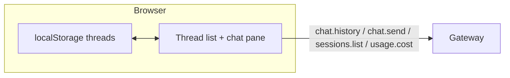

# Multiple chat threads (per `sessionKey`)

## Why it exists

Operators often need **more than one isolated conversation** with the gateway without opening extra browser profiles. The gateway already partitions transcripts and live traffic by **`sessionKey`**; this UI keeps a **thread list** so each row maps to its own key and history.

## Conceptual model

- **Thread** — One UI row: label plus a stats line (message count, optional tokens / USD); the gateway `sessionKey` is stored for routing but not shown in the list. Not the same as OpenClaw **workspaces** (Telegram channels, CLI profiles, etc.); those are product concepts configured on the gateway. This app only controls which **`sessionKey`** is sent on the operator WebSocket.
- **Canonical vs short `sessionKey`** — The UI stores short keys for new web chats (e.g. `webchat-<uuid>`) and sends them on `chat.send` / `chat.history` (the gateway accepts them). `sessions.list` returns each row’s canonical **`key`** (e.g. `agent:main:webchat-<uuid>`). The client **aliases** token stats to both forms so lookups match. See [`openClawSessionSuffixFromCanonicalKey`](../src/api/gatewaySessionsList.ts).
- **Active thread** — Drives `chat.send`, `chat.history`, and which incoming **`chat` events** are applied (see below).

## Flows

### Load and migrate

1. On first load, the app reads **`openclaw-ui-chat-threads-v1`** from `localStorage`.
2. If that key is missing but the legacy **`openclaw-ui-session-key`** exists, the app **migrates** to a single thread and removes the legacy key.
3. If neither exists, the app creates **Chat 1** with `sessionKey` **`main`** unless **`VITE_OPENCLAW_SESSION_KEY`** is set (build-pinned key).

### Switch thread

1. User selects another thread (drawer / sidebar).
2. UI sets the active `sessionKey`, clears in-flight transcript state, and calls **`chat.history`** for that key.
3. A generation counter drops **stale** history responses if the user switches again before the request completes.
4. Incoming WebSocket **`chat` events** include `sessionKey` when the gateway sends it; the client **ignores** events whose key does not match the active thread so background sessions cannot corrupt the visible pane.

### New conversation

**New conversation** (speech-bubble-plus icon in the Conversations panel header) appends a thread with a fresh `webchat-<uuid>` key, activates it, and loads history (typically empty). Older threads remain in the list.

### Build-pinned session

When **`VITE_OPENCLAW_SESSION_KEY`** is set, the gateway session is fixed. The UI **collapses** to a single thread using that key and **disables** the Conversations header **New conversation** control—same constraint as before multi-thread support.

## Technical details

| Piece | Role |
| --- | --- |
| [`src/utils/chatThreadsStorage.ts`](../src/utils/chatThreadsStorage.ts) | Snapshot shape (`version`, `threads`, `activeThreadId`), persist, migrate, helpers. |
| [`src/api/gateway.ts`](../src/api/gateway.ts) | `sendChatMessage(msg, { sessionKey })`, `fetchChatHistory(limit, sessionKeyOverride)`, `fetchGatewaySessionsList()` (`sessions.list`), `fetchGatewayUsageCost()` (`usage.cost`), `getActiveChatSessionKey` on `initGatewayConnection` for event routing. |
| [`src/api/gatewaySessionsList.ts`](../src/api/gatewaySessionsList.ts) | Parse `sessions.list` into token stats; **suffix aliasing** for `agent:<id>:…` keys; default agent id from list or **`health`** payload; optional `sessions.list` cost-probe logging (`VITE_OPENCLAW_DEBUG` or `VITE_OPENCLAW_SESSIONS_DEBUG` in dev). |
| [`src/api/gatewayUsageCost.ts`](../src/api/gatewayUsageCost.ts) | Defensive parse of `usage.cost` (aggregate + optional per-session map); merges unscoped + `sessionKey`-scoped responses; debug logging alongside sessions probe. |
| [`src/App.tsx`](../src/App.tsx) | Thin top bar (version, connection, chips, stats); drawer (mobile) / permanent sidebar (desktop); thread selection; stale history guard. Top bar and sidebar show **message count**, **token totals** (`sessions.list`), and **estimated USD** when `usage.cost` returns parseable fields (per-session if present, else an all-sessions aggregate). Cached token totals in `localStorage` for inactive threads. |

## Technical gotchas

- **Gateways that omit `sessionKey` on `chat` events** — The client cannot filter by session; avoid relying on multiple simultaneous in-flight runs across threads on such gateways.
- **Thread labels are local** — Row titles and ordering live in this browser’s `localStorage`. Token totals are refreshed from the gateway via **`sessions.list`**. Cost lines use **`usage.cost`**; response shapes vary by gateway version—if nothing parses, the UI stays tokens-only. See [API usage & costs](https://docs.openclaw.ai/reference/api-usage-costs) and [Token use & costs](https://docs.openclaw.ai/reference/token-use).
- **Gateways that omit `sessions.list` or return an unexpected shape** omit token counts in the header/sidebar until the RPC succeeds or the session appears in the list.
- **Operator naming** — Prefer **conversation** / **`sessionKey`** in UI copy; reserve **workspace** for gateway docs and multi-channel setup ([configuration reference](https://docs.openclaw.ai/gateway/configuration-reference)).

## Related documentation

- [New chat session](new-chat-session.md) — history of session rotation and env pin.
- [Agent run phase](agent-run-phase.md) — new conversation disabled while a run blocks input.
