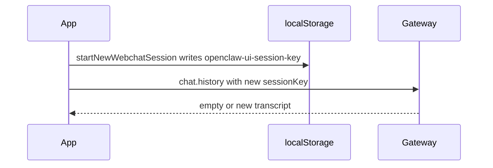

# New chat (replace current thread)

## Why it exists

Operators need a **fresh agent context** without old turns in the model’s session. Reloading the page re-fetches `chat.history` for whatever `sessionKey` the UI uses, so clearing only local state is not enough. This app **rotates** the session key in the browser and talks to the gateway under the new id.

## Conceptual flow

## Technical details

| Piece | Role |
| --- | --- |
| [`startNewWebchatSession`](../src/api/gateway.ts) | Writes `webchat-<uuid>` to `localStorage` key `openclaw-ui-session-key`. |
| [`sessionKey()`](../src/api/gateway.ts) resolution | 1) `VITE_OPENCLAW_SESSION_KEY` (build-pinned). 2) Stored `openclaw-ui-session-key`. 3) Connect hello `mainSessionKey`. 4) `'main'`. |
| Header control | **New chat** icon → confirm dialog → `startNewWebchatSession` → `resetLocalChatState` → `fetchChatHistory` → hydrate messages + reasoning. |

There is **no** thread list and **no** way to return to a previous session from this UI in the current product.

## Technical gotchas

- **`VITE_OPENCLAW_SESSION_KEY`:** When set, the session key is **pinned** by the build. The New chat button is **disabled**; operators must remove that env var to rotate sessions from the UI.
- **First visit:** With no stored key, behaviour matches the previous default (hello `mainSessionKey` or `'main'`). After the first New chat, the stored key wins until the user starts another New chat.
- **Server retention:** Old sessions may remain on the gateway disk; rotation only stops referencing them from this client.
- **Manual verification:** New chat → empty thread → hard reload → thread should stay new (only messages sent after New chat).

## Related documentation

- [Agent run phase](agent-run-phase.md) — New chat is disabled while a run is in progress.
