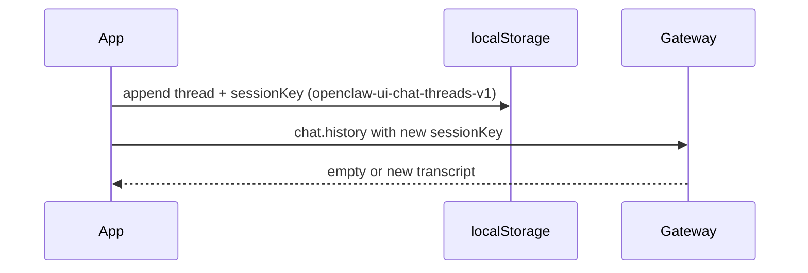

# New conversation (new gateway `sessionKey`)

## Why it exists

Operators need a **fresh agent context** without old turns in the model’s session. Reloading the page re-fetches `chat.history` for the **active** thread’s `sessionKey`, so clearing only local state is not enough. This app can **add a new thread** with a new key while keeping older threads in the sidebar.

## Conceptual flow

## Technical details

| Piece | Role |
| --- | --- |
| Thread storage | [`src/utils/chatThreadsStorage.ts`](../src/utils/chatThreadsStorage.ts) — `openclaw-ui-chat-threads-v1`; migrates legacy `openclaw-ui-session-key` once. |
| [`sessionKey()`](../src/api/gateway.ts) resolution (fallback when no override) | 1) `VITE_OPENCLAW_SESSION_KEY` (build-pinned). 2) Legacy stored `openclaw-ui-session-key` (until migrated). 3) Connect hello `mainSessionKey`. 4) `'main'`. |
| Conversations panel | **New conversation** icon (speech bubble + plus) in the panel header → immediately appends a `webchat-<uuid>` thread, activates it, `fetchChatHistory` for that key → hydrate messages + reasoning (no confirmation dialog). |
| Multi-thread | See [Multiple chat threads](multiple-chat-threads.md) — sidebar lists threads; switching loads the correct history and routes live `chat` events. |

## Technical gotchas

- **`VITE_OPENCLAW_SESSION_KEY`:** When set, the session key is **pinned** by the build. The New conversation button is **disabled** and the thread list collapses to one row; operators must remove that env var to rotate sessions from the UI.
- **First visit:** With no stored threads, behaviour matches the previous default (hello `mainSessionKey` or `'main'`). After adding threads, each row keeps its own `sessionKey` until the user starts another new conversation.
- **Server retention:** Old sessions may remain on the gateway disk; new threads only change which keys this client uses.
- **In-flight guard:** While a new thread is being created (`chat.history` in flight), the icon stays **disabled** to avoid overlapping requests.
- **Manual verification:** New conversation → empty thread → switch to an older thread → history matches that key → hard reload → thread list restored from `localStorage`.

## Related documentation

- [Multiple chat threads](multiple-chat-threads.md) — thread model, routing, storage.
- [Assistant run chrome](assistant-run-chrome.md) — New conversation is disabled while a run is in progress.
